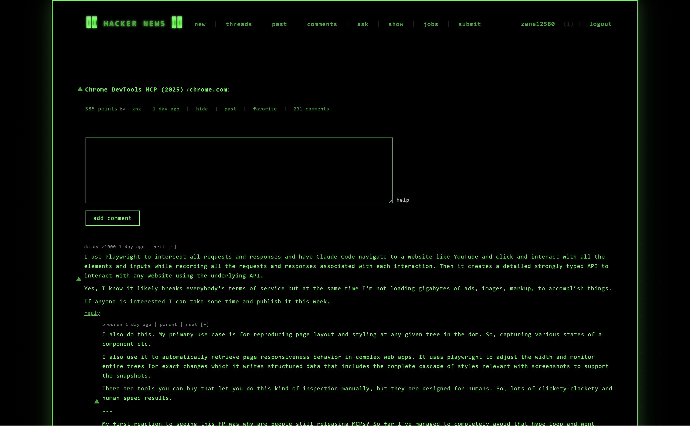
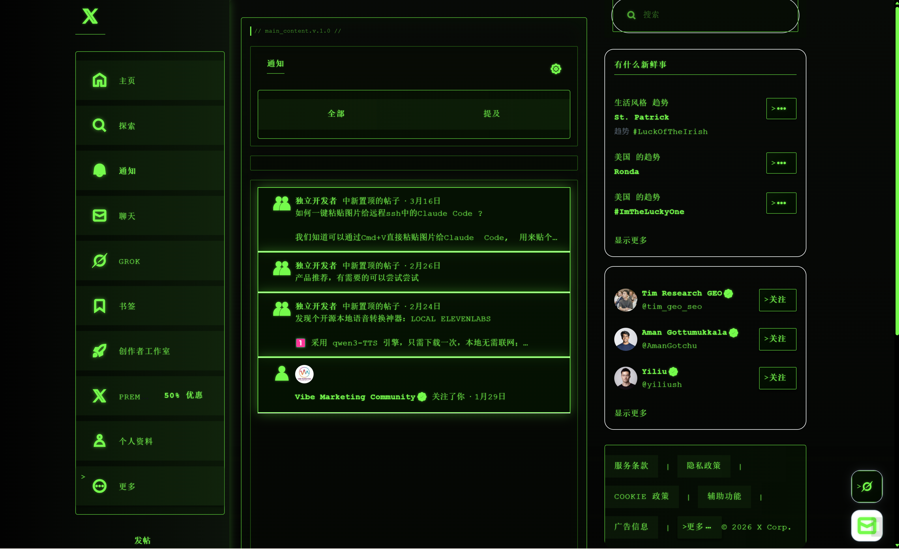
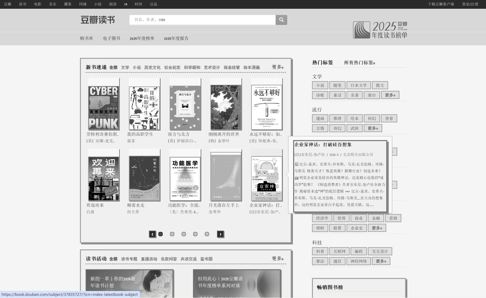
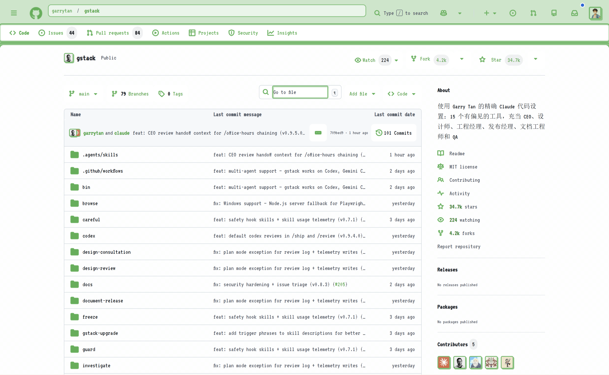

# StyleSwift (数字女娲)

<div align="center">


**Give your favorite websites a fresh look with a single sentence**

[](https://chromewebstore.google.com/detail/styleswift/llchggmimjgnbjlcgpkjmplhfbkjjcli) [](https://openai.com/) [](https://www.anthropic.com/) [](https://ai.google.dev/) [](https://www.deepseek.com/)

[English](#english) | [中文](#中文)

</div>

---

## English

### What is StyleSwift?

**StyleSwift is an AI Agent that transforms any website's appearance with a single sentence.**

Just describe what you want: "Make it look like The Matrix" or "Give me an e-ink reading mode" — the Agent understands your intent, analyzes the page, and applies styles automatically.

### Why Different from Claude Code?

Claude Code is powerful, but not designed for web styling. StyleSwift fills that gap:

| Claude Code | StyleSwift |
|-------------|------------|
| General-purpose coding assistant | Specialized for web styling |
| Manual DOM inspection needed | Auto page analysis with `grep`, `get_page_structure` |
| Basic CSS generation | Customized tools → 80% better style quality |
| Styles may conflict with site CSS | Seamless integration with official styles |
| High token usage (full page dump) | Efficient token usage (fetch what's needed) |
| No style persistence | Style skills library, cross-site reuse |
| No visual feedback loop | QualityAudit sub-agent auto-detects issues |

**Key Advantages**:
- 🔄 **Easy Style Switching** — Apply, rollback, transfer styles between sites
- 🎨 **Seamless Integration** — Generated styles blend with official CSS, no visual glitches
- ⚡ **Better Quality** — Specialized tools produce 80% more polished results
- 💰 **Token Efficient** — Model decides what info is needed, no full page dumps

### Core Capabilities

| Capability | Description |
|------------|-------------|
| **Natural Language Understanding** | Parse intent, plan execution — no preset workflows needed |
| **Autonomous Page Analysis** | Model decides what info is needed, calls tools on demand |
| **Dynamic Style Generation** | Generate optimal CSS based on intent and page characteristics |
| **Visual Quality Loop** | Auto-detect issues after styling (contrast, accessibility), self-repair |
| **Style Learning & Transfer** | Extract visual features, reuse styles across websites |
| **Multi-turn Memory** | Session isolation, context management, history compression |

### Effect Preview

<div align="center">

 |  | 
:---:|:---:|:---:
**Old Newspaper Style** | **The Matrix Style** | **One-Click Style Transfer**

 |  | 
:---:|:---:|:---:
**Bilibili Wes Anderson Style** | **Douban E-ink Style** | **GitHub Pixel Art Style**

Simply describe your design intent, and StyleSwift creates unique visual experiences for any website.

</div>

### Quick Start

#### Installation

**Chrome Web Store**: https://chromewebstore.google.com/detail/styleswift/llchggmimjgnbjlcgpkjmplhfbkjjcli

**From Source**:
```bash
git clone https://github.com/StyleSwift/StyleSwift.git
```

Load in Chrome:
1. Go to `chrome://extensions/`
2. Enable "Developer mode"
3. Click "Load unpacked"
4. Select `extension` folder

#### Usage

1. **Configure API**: Enter your API Key (supports OpenAI/Anthropic format)
2. **Open Panel**: Click extension icon
3. **Describe Your Need**:
   - "Give this page a dark mode"
   - "Make the navigation larger"
   - "Hide this ad" (use element picker first)
4. **Style Transfer**: Save successful styles, reuse on other sites

### Architecture Overview

```
┌─────────────────────────────────────────────────────────┐
│                   Agent Core Loop                        │
│  User Msg → Context → Model Reasoning → Tool → Result   │
│                          ↓                               │
│              ┌─────────────────────┐                     │
│              │    Tools System     │                     │
│              │  Page Ops | Styles  │                     │
│              │  Profile | Skills   │                     │
│              └─────────────────────┘                     │
└─────────────────────────────────────────────────────────┘
                          ↓
┌─────────────────────────────────────────────────────────┐
│            Runtime Carrier (Chrome Extension)            │
│   Side Panel (UI) ←→ Content Script (Page Ops)          │
└─────────────────────────────────────────────────────────┘
```

**Core Design**: Code provides atomic capabilities (tools), model handles reasoning and decision-making. See [ARCHITECTURE.md](doc/ARCHITECTURE.md) for details.

### License

Server Side Public License (SSPL). See [LICENSE](LICENSE).

### Acknowledgments

- [impeccable](https://github.com/pbakaus/impeccable) — style generation quality
- [learn-claude-code](https://github.com/shareAI-lab/learn-claude-code) — Agent design philosophy

---

## 中文

### 项目简介

**数字女娲 (StyleSwift) 是一个 AI Agent，一句话就能改变任何网站的外观。**

只需描述你的想法：「让它看起来像黑客帝国」或「给我一个墨水屏阅读模式」——Agent 会理解你的意图、分析页面、自动应用样式。

### 与 Claude Code 的不同之处

Claude Code 很强大，但并非为网页样式设计而生。数字女娲填补了这个空白：

| Claude Code | 数字女娲 |
|-------------|----------|
| 通用编程助手 | 专为网页样式设计 |
| 需手动检查 DOM | 自动页面分析（`grep`、`get_page_structure`） |
| 基础 CSS 生成 | 定制化工具 → 样式生成效果提升 80% |
| 样式可能与站点 CSS 冲突 | 与官方样式无缝衔接，无视觉瑕疵 |
| Token 消耗高（全页导出） | Token 高效（按需获取信息） |
| 无样式持久化 | 样式技能库，跨站点复用 |
| 无视觉反馈循环 | QualityAudit 子代理自动检测问题 |

**核心优势**：
- 🔄 **轻松切换** — 应用、回滚、跨站点迁移样式
- 🎨 **无缝衔接** — 生成的样式与官方 CSS 融合，无视觉冲突
- ⚡ **效果更好** — 专用工具生成效果提升 80%
- 💰 **更省 Token** — 模型按需获取信息，不导出全页

### Agent 核心能力

| 能力 | 说明 |
|------|------|
| **自然语言理解** | 解析意图，自主规划执行步骤，无需预设工作流 |
| **自主页面分析** | 模型决定需要哪些页面信息，按需调用工具 |
| **动态样式生成** | 根据意图和页面特征，生成最优 CSS 规则 |
| **视觉质检循环** | 样式应用后自动检测问题（对比度、可访问性），可自主修复 |
| **风格学习迁移** | 提取视觉特征，跨网站复用风格，持续学习用户偏好 |
| **多轮对话记忆** | 会话隔离、上下文管理、历史压缩 |

### 效果预览

<div align="center">

 |  | 
:---:|:---:|:---:
**旧报纸风格设计** | **黑客帝国风格设计** | **风格一键迁移**

 |  | 
:---:|:---:|:---:
**B站韦斯安德森风格** | **豆瓣墨水屏风格** | **GitHub像素风**

只需一句话，数字女娲即可理解你的设计意图并智能应用样式，为任何网站打造独特的视觉体验。

</div>

### 快速入手

#### 安装

**Chrome 应用商店**：https://chromewebstore.google.com/detail/styleswift/llchggmimjgnbjlcgpkjmplhfbkjjcli

**从源码安装**：
```bash
git clone https://github.com/StyleSwift/StyleSwift.git
```

在 Chrome 中加载：
1. 打开 `chrome://extensions/`
2. 启用「开发者模式」
3. 点击「加载已解压的扩展程序」
4. 选择 `extension` 文件夹

#### 使用

1. **配置 API**：首次启动输入 API Key（支持 OpenAI/Anthropic 格式）
2. **打开面板**：点击扩展图标打开侧边栏
3. **自然语言交互**：
   - 「给这个页面换个深色模式」
   - 「把导航栏放大一点」
   - 「隐藏这个广告」（先点元素选择器）
4. **风格迁移**：保存成功的风格，在其他网站复用

### 架构概览

```
┌─────────────────────────────────────────────────────────┐
│                   Agent 核心循环                          │
│  用户消息 → 上下文 → 模型推理 → 工具调用 → 结果           │
│                          ↓                               │
│              ┌─────────────────────┐                     │
│              │      工具系统        │                     │
│              │  页面操作 | 样式管理 │                     │
│              │  用户画像 | 技能库   │                     │
│              └─────────────────────┘                     │
└─────────────────────────────────────────────────────────┘
                          ↓
┌─────────────────────────────────────────────────────────┐
│            运行载体 (Chrome 扩展)                         │
│   Side Panel (UI) ←→ Content Script (页面操作)          │
└─────────────────────────────────────────────────────────┘
```

**核心设计**：代码提供原子化能力（工具），模型负责推理和决策。详见 [ARCHITECTURE.md](doc/ARCHITECTURE.md)。

### 许可证

Server Side Public License (SSPL)。详见 [LICENSE](LICENSE)。

### 致谢

- [impeccable](https://github.com/pbakaus/impeccable) — 显著提升样式生成质量
- [learn-claude-code](https://github.com/shareAI-lab/learn-claude-code) — Agent 设计理念

### 联系方式

<div align="center">


**扫码添加作者微信**，欢迎交流反馈。

</div>

---

<div align="center">

**[返回顶部](#styleswift-数字女娲)**

由 StyleSwift Team 制作

</div>