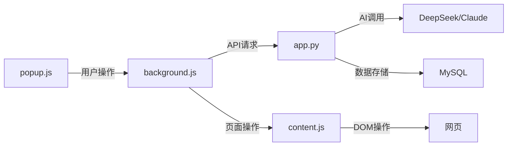
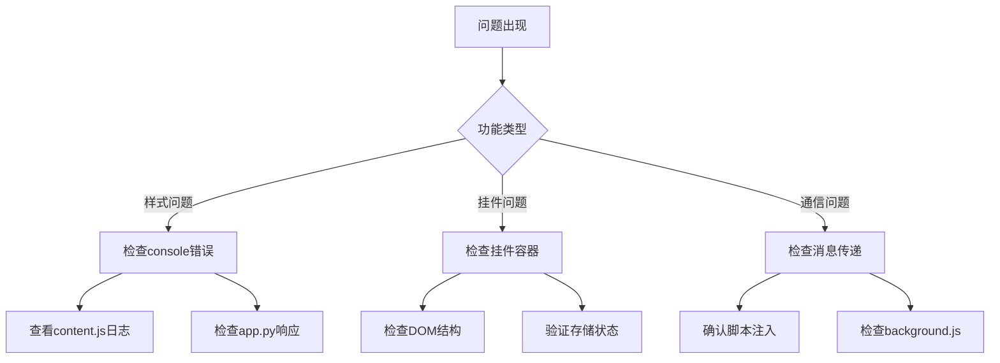

# StyleSwift 代码组织与维护指南

## 📋 目录

1. [项目结构概览](#项目结构概览)
2. [核心功能代码索引](#核心功能代码索引)
3. [代码架构说明](#代码架构说明)
4. [关键函数定位表](#关键函数定位表)
5. [开发维护规范](#开发维护规范)
6. [常见问题定位](#常见问题定位)
7. [代码模块化建议](#代码模块化建议)

---

## 🏗️ 项目结构概览

```
StyleSwiftV1/
├── 📁 前端扩展文件
│   ├── popup.js           (1205行) - 扩展界面逻辑
│   ├── content.js         (2600+行) - 页面操作核心
│   ├── background.js      (400+行) - 后台服务
│   ├── popup.html         - 扩展界面结构
│   └── manifest.json      - 扩展配置
├── 📁 后端服务
│   ├── app.py             (1696行) - Flask API服务
│   └── templates/         - 模板文件
├── 📁 文档
│   ├── 产品现状.md        - 产品功能文档
│   └── 代码组织指南.md    - 本文档
└── 📁 资源文件
    ├── images/            - 图片资源
    └── styles/            - 样式文件
```

---

## 🎯 核心功能代码索引

### 🎨 样式功能模块

#### **站点模式样式**
| 功能 | 文件位置 | 核心函数 | 行数范围 |
|------|----------|----------|----------|
| **样式生成总控制** | `popup.js` | `generateAndApplyStyle()` | 374-400 |
| **样式应用处理** | `popup.js` | `handleStyleApplication()` | 401-450 |
| **页面结构获取** | `popup.js` | `getPageStructureAndGenerateStyle()` | 451-520 |
| **自定义CSS应用** | `popup.js` | `applyCustomCSS()` | 574-620 |
| **样式应用到页面** | `content.js` | `applyStyle()` | 483-529 |
| **页面结构提取** | `content.js` | `getPageStructure()` | 627-800 |
| **AI样式生成API** | `app.py` | `generate_ai_style()` | 320-450 |

#### **细节模式样式**
| 功能 | 文件位置 | 核心函数 | 行数范围 |
|------|----------|----------|----------|
| **元素选择器** | `content.js` | `startElementSelection()` | 38-50 |
| **元素点击处理** | `content.js` | `handleElementClick()` | 239-300 |
| **元素样式应用** | `content.js` | `applyElementStyle()` | 1467-1635 |
| **元素样式生成** | `popup.js` | `generateAndApplyElementStyle()` | 1105-1205 |
| **AI元素样式API** | `app.py` | `generate_element_style()` | 500-600 |

### 🤖 挂件功能模块

#### **挂件管理**
| 功能 | 文件位置 | 核心函数 | 行数范围 |
|------|----------|----------|----------|
| **挂件应用总控制** | `popup.js` | `applyWidgetToAllSitesEnhanced()` | 760-850 |
| **自定义挂件生成** | `popup.js` | `generateCustomWidget()` | 851-950 |
| **代码挂件保存** | `popup.js` | `saveCustomWidgetCode()` | 951-1020 |
| **挂件容器创建** | `content.js` | `createWidgetContainer()` | 1965-2156 |
| **挂件行为应用** | `content.js` | `applyWidgetBehaviors()` | 2157-2191 |
| **AI挂件生成API** | `app.py` | `generate_ai_widget()` | 700-850 |

#### **挂件交互功能**
| 功能 | 文件位置 | 核心函数 | 行数范围 |
|------|----------|----------|----------|
| **拖拽功能** | `content.js` | `addWidgetDragFunctionality()` | 2403-2451 |
| **缩放功能** | `content.js` | `addWidgetResizeFunctionality()` | 2452-2491 |
| **状态保存** | `content.js` | `saveWidgetPosition()` | 2515-2542 |
| **跨页面同步** | `content.js` | `checkAndApplyGlobalWidget()` | 2633-2656 |

### 💾 数据管理模块

#### **数据库操作**
| 功能 | 文件位置 | 核心函数/类 | 行数范围 |
|------|----------|-------------|----------|
| **样式数据模型** | `app.py` | `class Style` | 220-240 |
| **挂件数据模型** | `app.py` | `class Widget` | 241-260 |
| **自定义CSS保存** | `app.py` | `save_custom_css()` | 600-650 |
| **评分提交** | `app.py` | `submit_rating()` | 550-580 |

#### **本地存储**
| 功能 | 文件位置 | 相关函数 | 行数范围 |
|------|----------|----------|----------|
| **样式状态检查** | `content.js` | `checkAndApplyStyle()` | 564-626 |
| **挂件状态同步** | `content.js` | `syncWidgetState()` | 2571-2608 |

---

## 🔧 代码架构说明

### 消息传递架构


### 核心数据流
1. **样式生成流程**: `popup.js` → `background.js` → `app.py` → `AI API` → `content.js`
2. **挂件应用流程**: `popup.js` → `app.py` → 所有`content.js`
3. **用户交互流程**: `content.js` → `popup.js` → `background.js`

---

## 📖 关键函数定位表

### 🔍 快速定位常用功能

#### **样式相关问题**
| 问题类型 | 主要检查文件 | 关键函数 |
|----------|--------------|----------|
| 样式不生效 | `content.js` | `applyStyle()`, `ensureStylePriority()` |
| AI生成失败 | `app.py` | `generate_ai_style_with_retry()` |
| 页面结构获取失败 | `content.js` | `getPageStructure()` |
| 自定义CSS问题 | `popup.js` | `applyCustomCSS()` |

#### **挂件相关问题**
| 问题类型 | 主要检查文件 | 关键函数 |
|----------|--------------|----------|
| 挂件不显示 | `content.js` | `applyWidget()`, `createWidgetContainer()` |
| 拖拽不工作 | `content.js` | `addWidgetDragFunctionality()` |
| 跨页面不同步 | `content.js` | `checkAndApplyGlobalWidget()` |
| AI生成挂件失败 | `app.py` | `generate_ai_widget_with_retry()` |

#### **通用问题**
| 问题类型 | 主要检查文件 | 关键函数 |
|----------|--------------|----------|
| 消息传递失败 | `background.js` | `chrome.runtime.onMessage` |
| 内容脚本未注入 | `background.js` | `ensureContentScriptInjected()` |
| 数据库连接问题 | `app.py` | 配置部分 (行1-100) |

---

## 📝 开发维护规范

### 代码编写规范

#### **JavaScript 规范**
```javascript
// ✅ 好的函数命名和注释
/**
 * 应用样式到指定元素
 * @param {string} style - CSS样式代码
 * @param {string} styleId - 样式ID
 * @returns {Promise<boolean>} 应用结果
 */
async function applyStyle(style, styleId) {
    const startTime = getBeijingTime();
    console.log('=== 样式应用开始 ===');
    // ... 实现代码
}

// ✅ 统一的错误处理
try {
    await someAsyncOperation();
} catch (error) {
    console.error('操作失败:', error);
    showFeedback('操作失败: ' + error.message, 'error');
}
```

#### **Python 规范**
```python
# ✅ 好的函数文档和类型提示
def generate_ai_style_with_retry(prompt: str, max_retries: int = 3) -> str:
    """
    使用重试机制生成AI样式
    
    Args:
        prompt: AI提示词
        max_retries: 最大重试次数
        
    Returns:
        生成的CSS样式代码
        
    Raises:
        Exception: 生成失败时抛出异常
    """
    app.logger.info(f"开始AI样式生成 - 最大重试次数: {max_retries}")
    # ... 实现代码
```

### 日志规范
```javascript
// ✅ 统一的日志格式
console.log('=== 功能模块名称 ===');
console.log('操作时间:', formatBeijingTime());
console.log('参数信息:', parameters);
console.log('处理结果:', result);
console.log('=== 功能模块完成 ===');
```

### 错误处理规范
```javascript
// ✅ 统一的错误处理模式
async function someFunction() {
    try {
        // 主要逻辑
        const result = await mainOperation();
        return { success: true, data: result };
    } catch (error) {
        console.error('someFunction 失败:', error);
        return { success: false, error: error.message };
    } finally {
        // 清理工作
        cleanup();
    }
}
```

---

## 🚨 常见问题定位

### 问题诊断流程图


### 常见错误代码对照表
| 错误类型 | 错误信息关键词 | 可能原因 | 解决方向 |
|----------|----------------|----------|----------|
| 样式不生效 | "Style not applied" | CSS语法错误/选择器失效 | 检查CSS代码和选择器 |
| AI调用失败 | "API request failed" | 网络问题/API密钥 | 检查网络和API配置 |
| 脚本注入失败 | "Cannot access" | 页面限制/权限问题 | 检查manifest权限 |
| 数据库连接失败 | "Database error" | 连接配置/服务状态 | 检查数据库服务 |

---

## 🔄 代码模块化建议

### 建议的模块化方案

#### **1. 样式管理模块 (styles/)**
```
styles/
├── styleGenerator.js    - 样式生成核心逻辑
├── styleApplicator.js   - 样式应用逻辑
├── cssProcessor.js      - CSS处理工具
└── elementSelector.js   - 元素选择器
```

#### **2. 挂件管理模块 (widgets/)**
```
widgets/
├── widgetManager.js     - 挂件管理核心
├── widgetBehaviors.js   - 挂件行为定义
├── widgetInteraction.js - 交互功能
└── widgetSync.js        - 跨页面同步
```

#### **3. 通信管理模块 (communication/)**
```
communication/
├── messageHandler.js    - 消息处理中心
├── apiClient.js         - API客户端
└── storageManager.js    - 存储管理
```

#### **4. 工具函数模块 (utils/)**
```
utils/
├── timeUtils.js         - 时间工具函数
├── domUtils.js          - DOM操作工具
├── validationUtils.js   - 验证工具
└── loggerUtils.js       - 日志工具
```

### 重构优先级
1. **高优先级**: 提取时间工具函数 (已在多个文件重复)
2. **中优先级**: 模块化样式管理 (代码量最大)
3. **低优先级**: 重构挂件系统 (功能相对独立)

---

## 📚 维护清单

### 每周检查项目
- [ ] 检查所有API接口响应时间
- [ ] 验证AI服务可用性
- [ ] 测试核心功能流程
- [ ] 检查错误日志

### 每月维护项目
- [ ] 数据库性能优化
- [ ] 代码注释更新
- [ ] 依赖包更新检查
- [ ] 安全性检查

### 新功能开发流程
1. 📝 功能设计文档
2. 🔧 核心逻辑实现
3. 🧪 单元测试编写
4. 📖 文档更新
5. 🚀 部署和验证

---

## 💡 最佳实践建议

### 代码可读性
- 使用有意义的变量名和函数名
- 保持函数功能单一性
- 添加必要的注释和文档
- 统一代码风格和格式

### 性能优化
- 避免在循环中进行DOM操作
- 使用事件委托减少事件监听器
- 合理使用缓存机制
- 优化AI API调用频率

### 错误处理
- 实现完整的错误捕获
- 提供用户友好的错误提示
- 记录详细的错误日志
- 建立错误恢复机制

---

*这份指南将随着项目发展持续更新，建议定期回顾和完善。* 